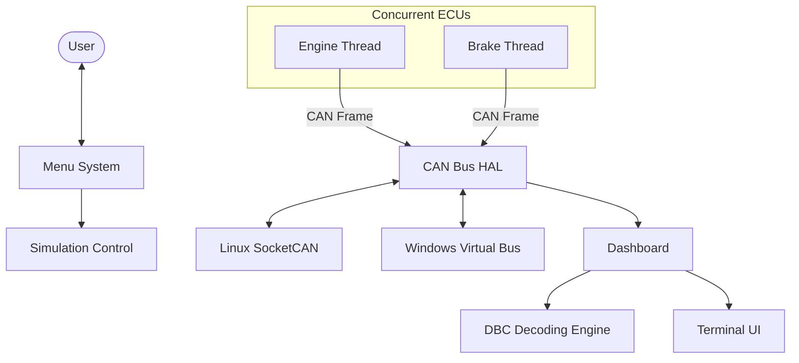

# Advanced Automotive CAN Bus Simulator (v2.0)

## 🚀 Recent Upgrades
This project has been upgraded to meet industry-level automotive software standards.

1.  **Hardware Abstraction Layer (HAL)**:
    -   Now supports **Linux SocketCAN** natively.
    -   Fall-back to a Virtual Bus for Windows simulation.
2.  **Multithreading**:
    -   Each ECU (Engine, Brake) runs in its own **pthread**, simulating true concurrent hardware logic.
3.  **DBC-Lite Engine**:
    -   Implemented a signal decoding engine that uses start-bits, scale factors, and offsets.
4.  **Unit Testing**:
    -   Added a testing suite in `tests/` to ensure frame reliability and decoding accuracy.
5.  **Clean Architecture**:
    -   Decoupled simulation logic from UI and bus drivers.

## 🏗️ System Architecture


## 🛠️ Build & Test
### Compile
```bash
mkdir build; cd build
cmake .. -G "MinGW Makefiles"
cmake --build .
```

### Run Tests
```bash
./can_tests.exe
```

### Run Simulator
```bash
./CANBusSimulator.exe
```

## 📂 Project Structure
- `include/`: API and Structure definitions.
- `src/`: ECU implementations and core drivers.
- `tests/`: Automated unit tests.
- `docs/`: Walkthroughs and architectural deep-dives.

## 📜 License
Educational use - Perfect for Engineering Portfolios.
